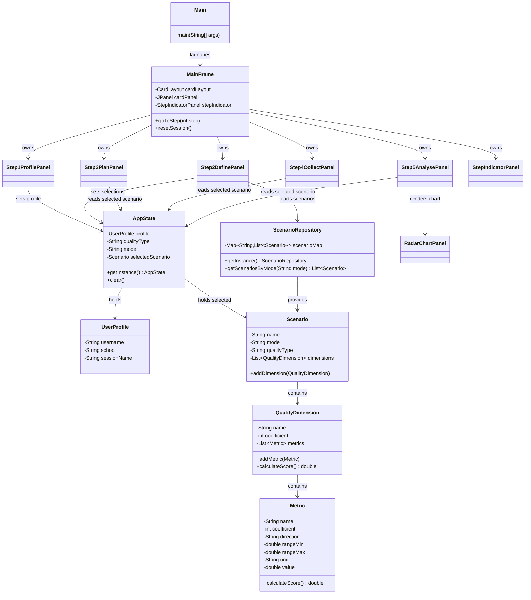

# Design

## Architecture (MVC-style Separation)

- `model/` -> domain entities, score logic, scenario repository, app state
- `gui/` -> Swing panels, wizard navigation UI, indicator, and chart rendering

## Design Patterns Used

- CardLayout Wizard: panel transitions handled in `MainFrame`
- Singleton: `AppState` and `ScenarioRepository`
- Repository Pattern: `ScenarioRepository` centralizes all hard-coded datasets

## Package Structure

```text
src/
  Main.java
  model/
    AppState.java
    Metric.java
    QualityDimension.java
    Scenario.java
    ScenarioRepository.java
    UserProfile.java
  gui/
    MainFrame.java
    RadarChartPanel.java
    Step1ProfilePanel.java
    Step2DefinePanel.java
    Step3PlanPanel.java
    Step4CollectPanel.java
    Step5AnalysePanel.java
    StepIndicatorPanel.java
    UIConstants.java
```

## Modes and Scenarios

- Custom: Custom Starter Scenario (bonus baseline dataset)
- Education: Scenario C (Team Alpha), Scenario D (Team Beta)
- Health: Scenario A (Hospital System), Scenario B (Pharmacy System)

## OOP Notes

- Encapsulation: private fields + getters in model classes
- Polymorphism: overridden `paintComponent` methods in custom UI components
- Cohesion: each class has a focused responsibility

## Score Calculation Formula

```text
Higher is better -> score = 1 + (value - min) / (max - min) * 4
Lower is better  -> score = 5 - (value - min) / (max - min) * 4
```

Rules:

- Clamp score to [1.0, 5.0]
- Round to nearest 0.5

## Class Diagram


