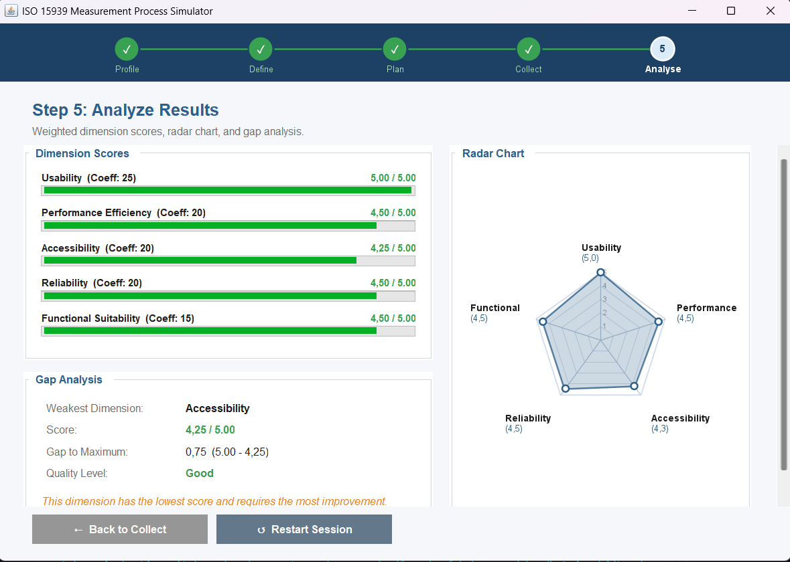

# ISO 15939 Measurement Process Simulator

Java Swing Desktop Application
Course: Software Project II

## Student Information

- **Student Name:** Yağız Yalçınöz
- **Student ID:** 202428054

## Project Summary

This application simulates the ISO 15939 software measurement process as a 5-step wizard built with Java Swing. It supports defining quality dimensions and metrics, collecting data, and analyzing results through weighted scores, a radar chart, and gap analysis.

Wizard steps:

1. **Profile** — Enter username, school, and session name
2. **Define** — Select quality type, mode, and scenario
3. **Plan** — View selected dimensions and metrics (read-only)
4. **Collect** — View raw metric values and calculated scores (1–5 scale)
5. **Analyse** — View weighted dimension scores, radar chart, and gap analysis

> No external libraries are used. Standard Java SE only.

## Package Structure

```
src/
  Main.java
  model/
    AppState.java
    Metric.java
    QualityDimension.java
    Scenario.java
    ScenarioRepository.java
    UserProfile.java
  gui/
    MainFrame.java
    StepIndicatorPanel.java
    UIConstants.java
    Step1ProfilePanel.java
    Step2DefinePanel.java
    Step3PlanPanel.java
    Step4CollectPanel.java
    Step5AnalysePanel.java
    RadarChartPanel.java
```

## Scenarios

| Mode      | Scenarios                                        |
|-----------|--------------------------------------------------|
| Health    | Scenario A — Hospital System, Scenario B — Pharmacy System |
| Education | Scenario C — Team Alpha, Scenario D — Team Beta  |
| Custom    | Custom Starter Scenario, Custom Advanced Scenario |

## Screenshot


